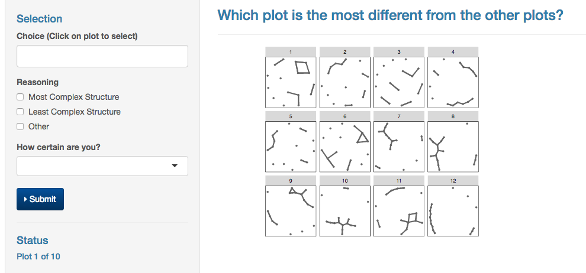

## Outline

- Introduction
- Stochactic Actor-Oriented Models for Social Networks
- Visual Inference Experiment
- Results
- Future Work

## Friendship Network

```{r, echo = FALSE, message=FALSE, warning=FALSE}
library(sna)
library(network)
friend.data.w1 <- as.matrix(read.table("../Data/s50_data/s50-network1.dat"))
friend.data.w2 <- as.matrix(read.table("../Data/s50_data/s50-network2.dat"))
fd2.w1 <- friend.data.w1[20:35,20:35]
fd2.w2 <- friend.data.w2[20:35,20:35]
drink <- as.matrix(read.table("../Data/s50_data/s50-alcohol.dat"))
drink2 <- drink[20:35,]
actual1 <- merge(data.frame(as.edgelist(as.network(fd2.w1))), 
                 data.frame(id = 1:16, drink = drink2[,1]), 
                 by.x = "X1", by.y = "id", all = T)
for (j in 1:nrow(actual1)){
      if (!(actual1$X1[j] %in% actual1$X2) & is.na(actual1$X2[j])){
        actual1$X2[j] <- actual1$X1[j]
      } else {actual1$X2[j] <- actual1$X2[j]}
}
actual2 <- merge(data.frame(as.edgelist(as.network(fd2.w2))), 
                 data.frame(id = 1:16, drink = drink2[,2]), 
                 by.x = "X1", by.y = "id", all = T)
for (j in 1:nrow(actual2)){
      if (!(actual2$X1[j] %in% actual2$X2) & is.na(actual2$X2[j])){
        actual2$X2[j] <- actual2$X1[j]
      } else {actual2$X2[j] <- actual2$X2[j]}
    }
actual1$wave <- 1
actual2$wave <- 2

waves <- rbind(actual1, actual2)
library(geomnet)
actual1$behaviour <- factor(actual1$drink)
levels(actual1$behaviour) <- c("None", "Once or twice a year", "Once a month", "Once a week")
set.seed(34567)
ggplot(data = actual1, aes(from_id = X1, to_id = X2)) + 
  geom_net(label = TRUE, hjust = 0.5, vjust=0.5, size=9,  
          labelcolour = "grey20", directed = T, arrowgap = .04,
           aes(colour = behaviour)) + 
  scale_colour_brewer("Drinking behavior", palette="YlOrRd") +
  theme_net() 

#ggplot(data = waves, aes(from_id = X1, to_id = X2)) + 
#  geom_net(label = TRUE, hjust = -.5, labelcolour = 'black', fiteach = T,
#           aes(color = as.factor(drink))) + 
#  theme_net() + theme(panel.background = element_rect(fill = "white", color = 'black')) + facet_wrap(~wave)
```

## Stochastic Actor Oriented Models

Observed networks: discrete observations of continuous time Markov Chain. 

1. Between observations:  actors act (i.e. change ties with others) at same rate
2. Actor aims to maximize  objective functon, $f_i(\mathbf{\beta},x) = \sum_k \beta_k s_{ki}(x)$.

## Model Parameters

1. Rate - how often girls change friendships 
2. Outdegree - measure of activeness
3. Reciprocity - how often friendships are reciprocated
4. Jumping Transitive Triplets - friends of the same person become friends

```{r, echo = FALSE, fig.height=2}
jTTe <- data.frame(from = c('i', 'i', 'h'), to = c('h', 'j', 'j'))
jTTn <- data.frame(id = letters[8:10], group = c(1,1,2))

jTT <- merge(jTTe, jTTn, by.x = 'from', by.y = "id", all = T)

set.seed(12345) 
ggplot(data = jTT, aes(from_id = from, to_id = to)) + 
  geom_net(aes(shape = as.factor(group)), directed = T, label = T, 
           labelcolour='grey80',vjust = 0.5, hjust =0.5, arrowgap = .15, 
           colour = 'black', size=10, 
           ecolour = c("red", "grey40", "grey40", "grey40")) + 
  expand_limits(x=c(-0.1,1.1), y=c(-0.1,1.1)) +
  theme_net() +
  theme(legend.position = "none")
```

## Two Models {.smaller}

```{r echo=FALSE, eval=FALSE}
A<- c(1, rep(0,4))

library(RSienaTest)
Multipar.RSiena(runs_models_smallFriends[[1]], 1)
Multipar.RSiena(runs_models_smallFriends[[1]], 2)
```

Effect name | Parameter | Corresponding Statistic | M1 | M2 | p-value M1 | p-value M2 |
:------------:|:-----------:|:-------------------------:|:----:|:----:|:--------:|:----:
Rate 1 (wave 1 $\rightarrow$ 2) | $\alpha_1$ | $\sum\limits_{i,j = 1 i \neq j}^n (x_{ij}(t_2) - x_{ij}(t_1))^2$  | **X** | **X** | -- | --
Rate 2 (wave 2 $\rightarrow$ 3) | $\alpha_2$ | $\sum\limits_{i,j = 1 i\neq j}^n (x_{ij}(t_3) - x_{ij}(t_2))^2$  | **X** | **X** | -- | --
Outdegree | $\beta_1$ | $s_{i1}(x) = \sum\limits_{j=1}^n x_{ij}$ | **X** | **X** | $5.67 \times 10^{-8}$ | $4.66 \times 10^{-10}$
Reciprocity | $\beta_2$ | $s_{i2}(x) = \sum\limits_{j=1}^n x_{ij}x_{ji}$ | **X** | **X** | $1.10 \times 10^{-5}$ | $4.42 \times 10^{-7}$
Jumping Transitive Triplets | $\beta_3$ | $s_{i3}(x) = \sum\limits_{\forall j\neq h} x_{ij}x_{ih}x_{hj} \mathbb{I}(v_i = v_h \neq v_j)$ | | **X** | -- | $0.00036$ 


## Can you see the difference? 

```{r echo=FALSE}
dat <- readr::read_csv("../Lineup-Images/ForExperimentTraining/datafiles/smallfriends-rev-m-12-rep-c.csv")
ggplot(data = dat %>% filter(plot_order2 %in% c(11,12)) %>% mutate(Model = plot_order2 - 10) ) + 
  geom_net(aes(from_id = X1, to_id = X2), size = 2, fiteach = T, directed = T, 
           colour = 'black', arrowsize = .25, arrowgap = .02, ecolour = 'grey60') + 
  facet_wrap(~Model, labeller = "label_both") + 
  theme_net() + theme(panel.background = element_rect(color = 'black'))
```

## Can you see the difference?

```{r echo=FALSE}
dat <- readr::read_csv("../Lineup-Images/ForExperimentTraining/datafiles/smallfriends-m-12-rep-1.csv")
ggplot(data = dat %>% filter(plot_order %in% c(2,7)) %>% mutate(Model = ifelse(plot_order == 2, 2, 1))) + 
  geom_net(aes(from_id = X1, to_id = X2), size = 2, fiteach = T, directed = T, 
           colour = 'black', arrowsize = .25, arrowgap = .02, ecolour = 'grey60') + 
  facet_wrap(~Model, labeller = "label_both") + 
  theme_net() + theme(panel.background = element_rect(color = 'black'))
```

## Question

Can we *see* a significant parameter when visualizing networks simulated from two different models?

- Idea: a very statistically significant difference in models should look different to us
- Method: visual inference - use lineups with graphs from models 1 & 2 to test this idea

## Lineup 

- Show $m$ plots to people
- Ask to identify most different plot
- Null ($m-1$ plots) vs. Alternative ($1$ plot) models
- Identification of the alternative plot is evidence against null
- Probability to pick alternative plot randomly is $\frac{1}{m}$

## Experiment

- M1 v. M2 (most complex structure)
- M2 v. M1 (least complex structure)
- five lineups each
- each participant randomly sees ten lineups

## Most complex? 

```{r, echo=FALSE, fig.align='center'}
dat <- readr::read_csv("../Lineup-Images/ForExperimentTraining/datafiles/smallfriends-m-12-rep-10.csv")
ggplot(data = dat) +
  geom_net(aes(from_id = X1, to_id = X2), size = 1, fiteach = T, directed = T, 
           colour = 'black', arrowsize = .15, arrowgap = .02, ecolour = 'grey60') + 
  facet_wrap(~plot_order) + 
  theme_net() + theme(panel.background = element_rect(color = 'black'))
```

## Least Complex? 

```{r echo=FALSE, fig.align='center'}
dat <- readr::read_csv("../Lineup-Images/ForExperimentTraining/datafiles/smallfriends-rev-m-12-rep-b.csv")
ggplot(data = dat) +
  geom_net(aes(from_id = X1, to_id = X2), size = 1, fiteach = T, directed = T, 
           colour = 'black', arrowsize = .15, arrowgap = .02, ecolour = 'grey60') + 
  facet_wrap(~plot_order2) + 
  theme_net() + theme(panel.background = element_rect(color = 'black'))
```

## Small Amazon Turk experiment




## Results 1

``` {r, echo=FALSE}
tab <- readr::read_csv("../Results/turk21_users.csv")
res <- readr::read_csv("../Results/turk21_feedback.csv")
```

- barchart with filled correct 

## Results 2

- scatterplot of %correct by beta 3
- scatterplot of %correct by #jtt

## Conclusion

- Doesn't work for networks
- Need another way! (layout?)
